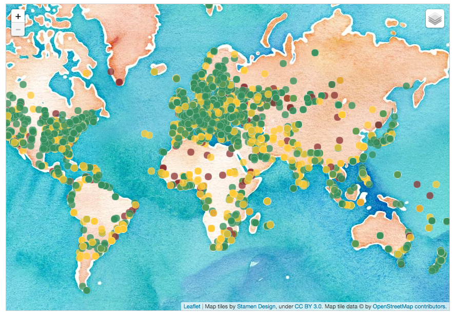
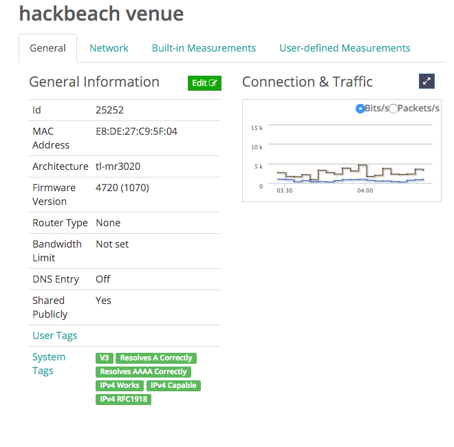
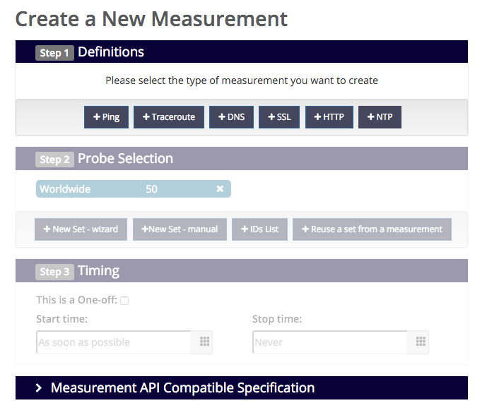

title: Hello world
author:
    name: Dhananjay Balan
    twitter: notmycommit
output: output.html
controls: true

--

# RIPE Atlas
## Global Internet monitoring.
## https://atlas.ripe.net

--

Global, volunteer hosted probes and Atlas central server

--

## Probes

--
#### Data Collected
 - Its own network configuration and uptime data
 - RTT (round trip time) measurements (on IPv4) to the first and second hops (think about the first two lines in your outgoing traceroutes)
 - Ping measurements to a number of predetermined destinations
 - Traceroute measurements to a number of predetermined destinations
 - DNS queries to root DNS servers (others to come)
 - SSL queries to a number of predetermined destinations 

-- 

### Data interface

--

### User defined measurements

--

# sign up!
##https://wiki.hackbeach.in/atlas-probes

--
